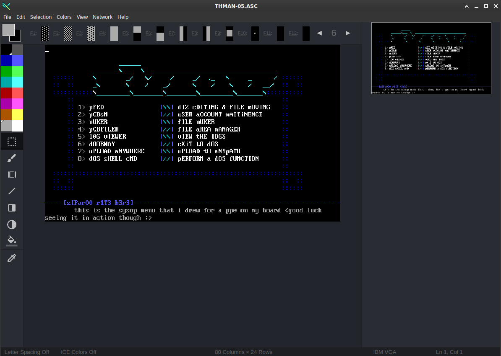
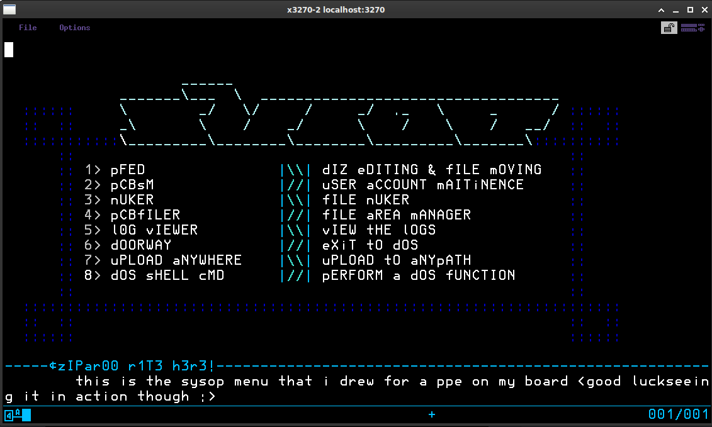
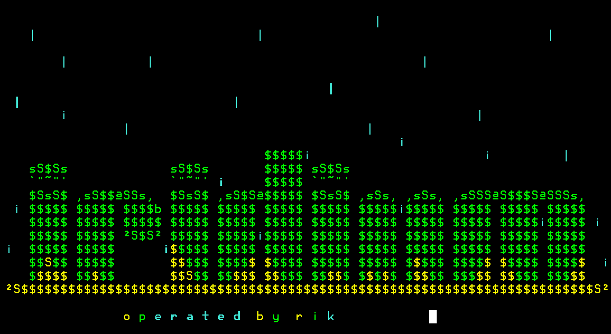
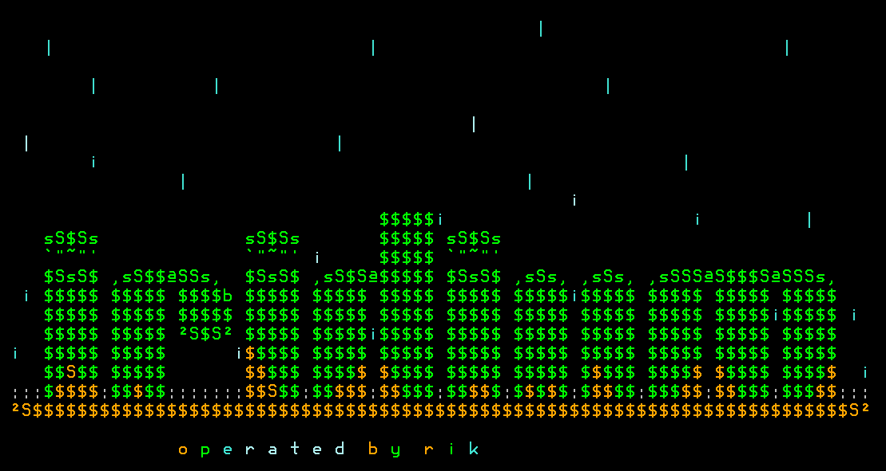

# ANSi to EBCDiC

From:



To:


(source: https://16colo.rs/pack/twst0297/THMAN-05.ASC)

This python script does a little bit more than converting ANSi art to EBCDiC but the name is catchy.

This script will take any ANSi art you can find/create and convert it in to the HLASM/JCL you need to display the art in TN3270. Some great ANSi/ASCii art can be found at https://16colo.rs

## Installation

ANSi2EBCDIC requires Python3 and the library [SAUCE](https://github.com/tehmaze/sauce).
Due to the SAUCE library not having a Python3 Pypi release right now, the installation
is a bit messy.

You can install and run ANSi2EBCDIC like this:

```bash
$ git clone https://github.com/mainframed/ANSi2EBCDiC.git
$ cd ANSi2EBCDiC
$ python3 -m venv app
$ git clone https://github.com/tehmaze/sauce.git
$ (cd sauce && ../app/bin/python3 setup.py install)
$ app/bin/python3 ansi2ebcdic.py --help
```

## Usage

The output produced by this script will assemble and link your program and place it where it needs to go so you can use it in VTAM usstables (z/OS and TK4-) or just run it from TSO.

This script gives you multiple options and works on z/OS as well as Jay Moseley's Sysgen and TK4- (running on hercules). These options can be broken down as the following:

### --usstable

If you're running your own zPDT z/OS mainframe, or you just want to spruce up your corporate mainframe this option will take whatever ANSi art you pass it and convert it to the HLASM/JCL needed to make a valid USS Table for VTAM.

When generating a USS Table you need a place to allow user input. By default this script places the cursor, in red, at row 23, column 20 with a field size of 20. You can change these by supplying a row, column and color by specifying the following:

* `--color` the color for the cursor, default is red
* `--ROW` the row for the cursor, default is 23
* `--COL` the column for the cursor, default is 20
* `--input` how wide the input area is, default is 20

For USS tables you need to supply a member name with `--member`, this should be the member name in your TN3270 parmlib `BEGINVTAM` (config file) in your TCPIP configuration.

```
BEGINVTAM
  ...
  USSTCP MEMBER

ENDVTAM
```
replace MEMBER with your member name, the default is ANSIART.

You also need to supply a dataset with `--dataset`, this is where the assembled HLASM will be stored. It needs to be in your VTAM library. On zPDT/ADCD you can typically store it in USER.VTAMLIB. This setting is set in your VTAM start procedure under `//VTAMLIB` and the search order is top to bottom.

Once uploaded with either FTP or IND$FILE, you need to submit the job with `submit` in ISPF, then you need to refresh and reload the USS Table. To do this use the MVS command: `vary tcpip,tn3270,obeyfile,dsn=user.tcpparms(tn3270)`, replace `USER.TCPPARM(TN3270)` with the location of your actual TN3270 settings. To do this on ADCD, in ISPF enter the command `=sd` and hit enter. Then type `/` hit enter, then enter the command `vary tcpip,tn3270,obeyfile,dsn=user.tcpparms(tn3270)`.

## --sysgen

This is for use on Jay Moseley's SYSGEN or the [automated sysgen](https://github.com/MVS-sysgen/sysgen). This replaces the standard MVS VTAM screen with the ansi art supplied. This script will automatically generate the JCL you need to create your own VTAM netsol screen. **Note:** You must install the optional `SYS2.MACLIBS` for this to work. To install you can type `INSTALL MACLIBS` in TSO. 

Unlike usstable, you don't need to supply a dataset name as the dataset use to store the compiled uss table is stored in `SYS1.VTAMLIB(ISTNSC00)`. The source HLASM generated is stored in the member name supplied by `--member` in `SYS1.UMODMAC`.

When generating you need a place to allow user input. By default this script places the cursor, in red, at row 23, column 20 with a field size of 20. You can change these by supplying a row, column and color by specifying the following:

* `--color` the color for the cursor, default is red
* `--ROW` the row for the cursor, default is 23
* `--COL` the column for the cursor, default is 20
* `--input` how wide the input area is, default is 20

Once you've uploaded (using FTP or IND$FILE) the JCL, submit it in TK4- with `submit` and run the following commands to refresh VTAM:

```
 Shut down the services:
     /Z NET,QUICK
     /P SNASOL
     /P JRP
 Then bring the services back:
     /S NET
     /S SNASOL
     /S JRP
```
## --netsol

This is for use on TK4- (or potentially any MVS 3.8j implementation but has only been tested on TK4-). This replaces the standard MVS TK4- VTAM screen with the ansi art supplied. This script will automatically generate the JCL you need to create your own VTAM netsol screen. It keeps the terminal ID/dat and time in the upper left/right of the terminal.

Unlike usstable, you don't need to supply a dataset name as the dataset use to store the compiled uss table is stored in `SYS1.VTAMLIB(ISTNSC00)`. The source HLASM generated is stored in the member name supplied by `--member` in `SYS1.UMODMAC`.

When generating a USS Table you need a place to allow user input. By default this script places the cursor, in red, at row 23, column 20 with a field size of 20. You can change these by supplying a row, column and color by specifying the following:

* `--color` the color for the cursor, default is red
* `--ROW` the row for the cursor, default is 23
* `--COL` the column for the cursor, default is 20
* `--input` how wide the input area is, default is 20

Once you've uploaded (using FTP or IND$FILE) the JCL, submit it in TK4- with `submit` and run the following commands to refresh VTAM:

```
 Shut down the services:
     /Z NET,QUICK
     /P SNASOL
     /P JRP
 Then bring the services back:
     /S NET
     /S SNASOL
     /S JRP
```

### --tso

If you don't want to change your VTAM terminals but instead just want to show off some amazing ANSI art (for example in a TSO exit, or for use with logon procs, or you just want to call it yourself) you can use the `--tso` argument.

This argument generates the HLASM/JCL you need to be able to call an assembled program from TSO and display the art to your 3270 terminal.

Since the JCL for TK4- and z/OS are different you need to supply either `--tk4` or `--zos` when using this argument.

By default the script stores the assembled output in `ANSI.ART(ANSIART)`. To change this use the `--dataset` and `--member` arguments. The dataset needs to be a previously created PDS/PDSE before you place your art in it.

Once the script is done you can upload your HLASM/JCL with FTP or IND$FILE and submit the JCL. To view the art, in TSO use the command `CALL ANSI.ART(ANSIART)` using the `--dataset` and `--member` if you changed those.


### Optional arguments

#### Output File:

By default this script will display the HLASM to the terminal. If you want to save it to a file use the `--file` argument.

#### Extended colors

By default most TN3270 emulators only support the colors: white, red, green, yellow, blue, pink, and turquoise. On some emulators, for example `x3270` you can get extra the extra colors: black, deep blue, orange, purple, pale green, pale turquoise, and grey.

If you know your terminal supports the extra colors use the argument `--extended` to enable them. If the ANSi you are your using uses the default/dim colors you'll want to enable this feature.

Example, here's the original art: https://16colo.rs/pack/5th-9704/LK-IRID1.ANS

**Default Graphics**



**Extended Graphics**



### Debug

If you want to see what the script is doing behind the scenes there is a `--debug` argument. Be warned, however, that this debug output is very verbose.

Example output (with debuging enabled):

```
./ansi2ebcdic.py --dataset ANSI.ART --member IRIDIUM --tso --tk4 --file iridium2.jcl --jobname iridium --extended --debug ./LK-IRID1.ANS
[+] ANSi to EBCDiC Starting
[+] Arguments:

    ANSi File:	/home/mainframed/ansi/LK-IRID1.ANS
    Type:		TSO (TK4-)
    Jobname:	iridium
    Dataset:	ANSI.ART
    Member:		IRIDIUM

[+] ANSi File Info:

    Original Author:	lightning knight
    Original Group:	(the 5th..)
    Original Date:	19970817

DEBUG    :: ansi_state_machine     :: (1,1) Escape Sequence Found
DEBUG    :: parse_escape           :: (1,1) type: m Sequence: 0 (desc: Set styles and colors from here onwards)
DEBUG    :: parse_escape           :: (1,1) Color Escape Sequence
DEBUG    :: parse_escape           :: (1,1) Current FG: (FG) White Bold: False
DEBUG    :: parse_escape           :: (1,1) Normal Display (FG) White  (SA: 2800002842F7)
DEBUG    :: add_sba                :: (1,1) setting SBA: 1,1
DEBUG    :: add_hlasm              :: (1,1) adding hlasm:
* (1,1) Normal Display (FG) White
         DC    X'2800002842F7'
DEBUG    :: ansi_state_machine     :: (1,1) Newline Found
DEBUG    :: ansi_state_machine     :: (2,49) Escape Sequence Found
DEBUG    :: print_ascii            :: (2,49) printing ascii: "                                                "
DEBUG    :: compress               :: (2,49) Compressing:
DEBUG    :: compress               :: (2,49) Results: [(' ', 48)]
DEBUG    :: print_ascii            :: (2,49) received compressed ascii: [(' ', 48)]
DEBUG    :: add_hlasm              :: (2,49) adding hlasm:
         DC    48C' '
DEBUG    :: parse_escape           :: (2,49) type: m Sequence: 36 (desc: Set styles and colors from here onwards)
DEBUG    :: parse_escape           :: (2,49) Color Escape Sequence
DEBUG    :: parse_escape           :: (2,49) Current FG: (FG) White Bold: False
DEBUG    :: parse_escape           :: (2,49) (FG) Turquoise  (SA: 2842F5)
DEBUG    :: add_sba                :: (2,49) setting SBA: 2,49
DEBUG    :: add_hlasm              :: (2,49) adding hlasm:
         $SBA  (2,49)
DEBUG    :: add_hlasm              :: (2,49) adding hlasm:
* (2,49) (FG) Turquoise
         DC    X'2842F5'
DEBUG    :: ansi_state_machine     :: (2,50) Escape Sequence Found
DEBUG    :: print_ascii            :: (2,50) printing ascii: "|"
DEBUG    :: compress               :: (2,50) Compressing: |
DEBUG    :: compress               :: (2,50) Results: [('|', 1)]
DEBUG    :: print_ascii            :: (2,50) received compressed ascii: [('|', 1)]
DEBUG    :: add_hlasm              :: (2,50) adding hlasm:
         DC    C'|'
...
```


## Known Bugs

You will run out of addressability if the ANSi art is too complicated. This could be fixed in a future version.
